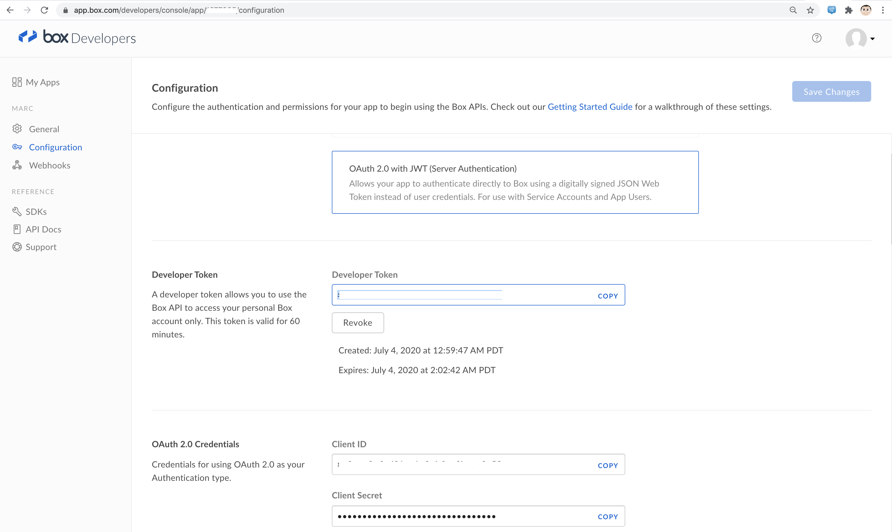
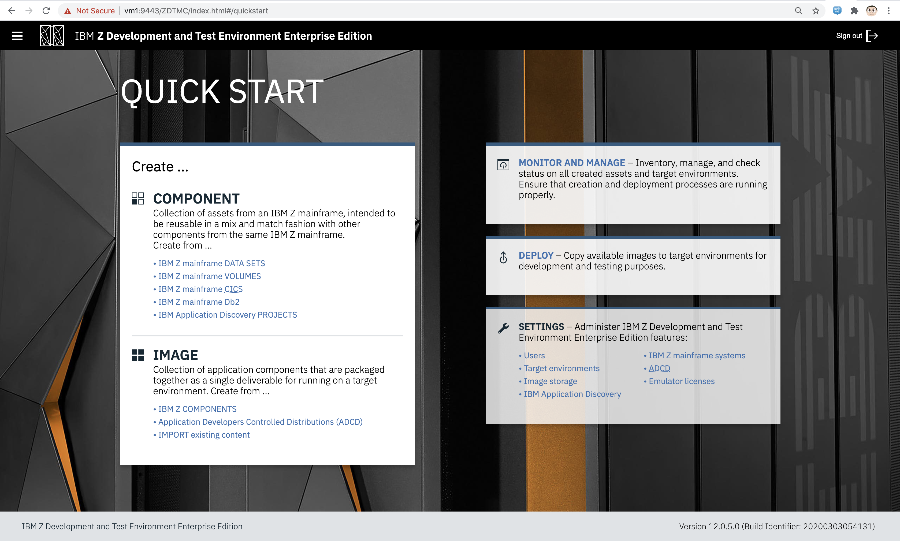
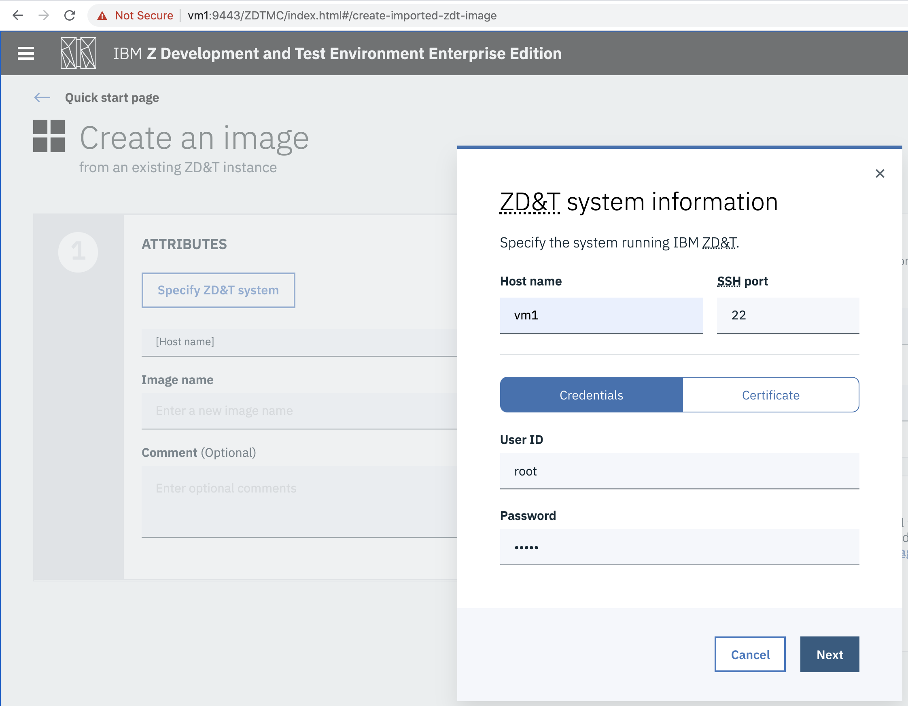
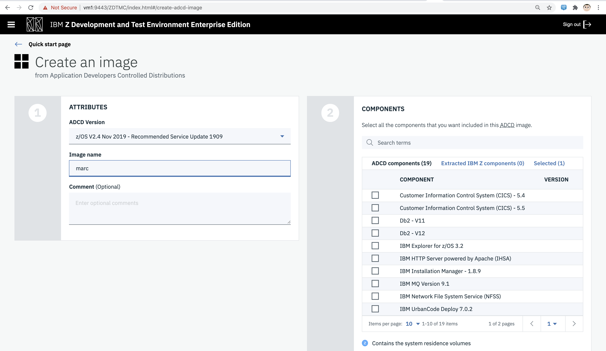
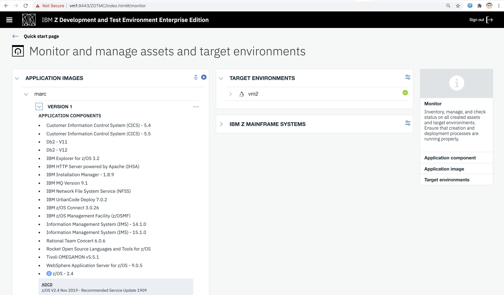
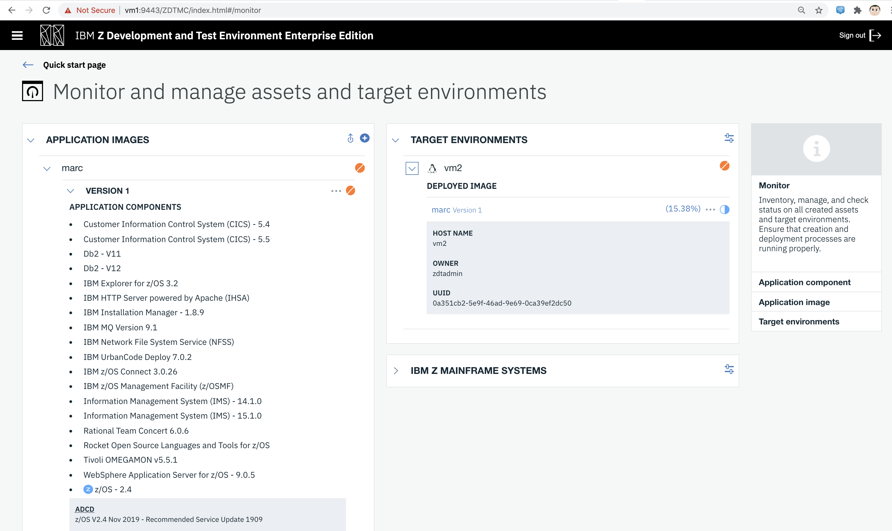
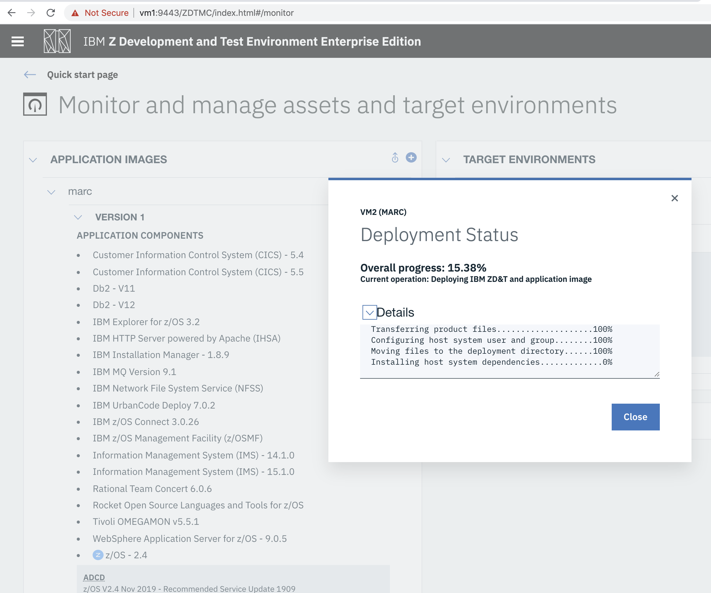
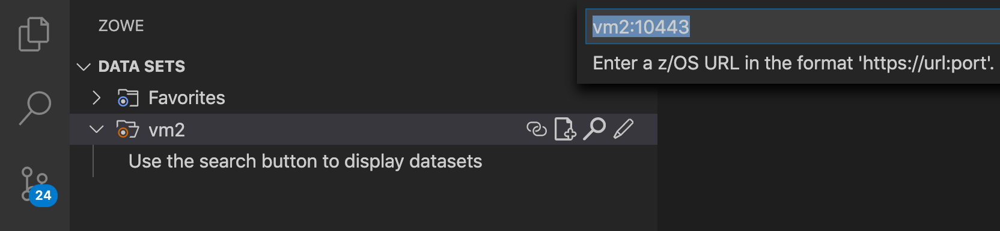
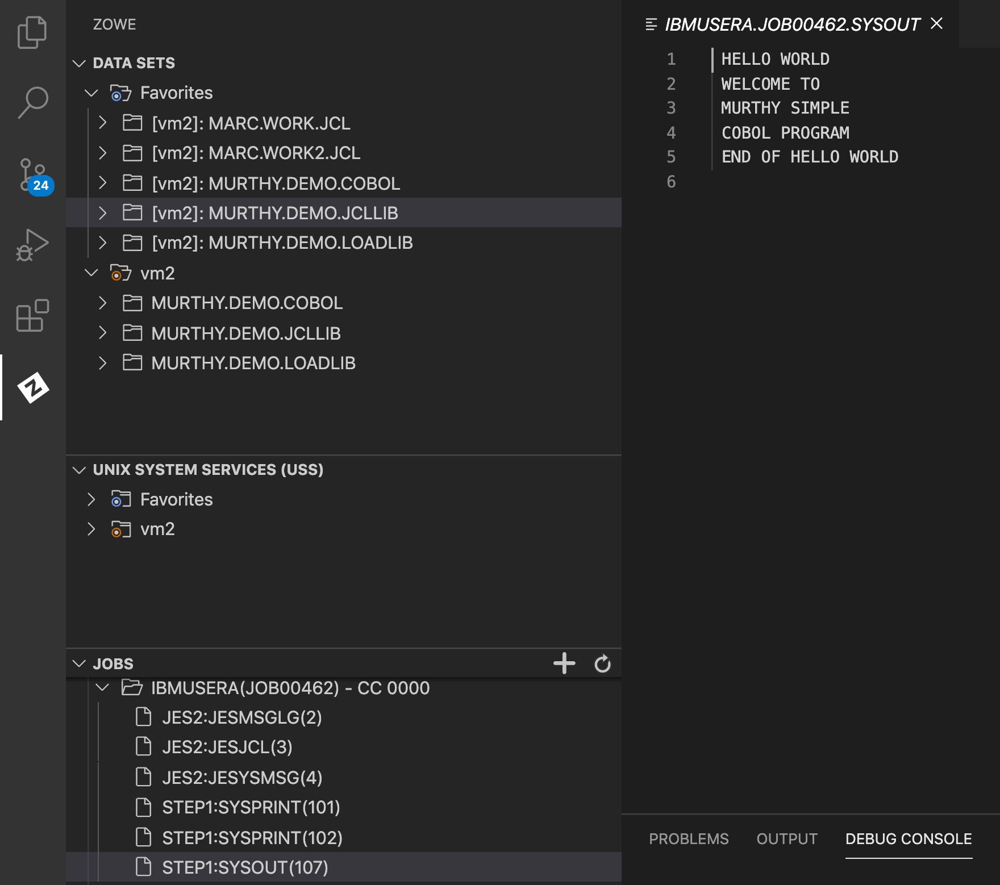

== Install OpenShift 4 clusters, emulated mainframe (ZD&T EE) and Ansible/molecule/podman 
== for Ansible/Z and Cloud Broker testing

NOTE: Requirements.
----
Internet-connected x86_64 baremetal server with RHEL 8.2; also works with RHEL 7 (just replace dnf with yum).

Sufficient CPU/Memory and virtualization support for KVM/libvirt.

Virtualization support enabled in the host's BIOS.
----

NOTE: we can share a baremetal server from Beaker/DSAL.

----
yum whatprovides fuser
....
psmisc-23.1-4.el8.x86_64 : Utilities for managing processes on your system
....
----

----
yum -y install psmisc-23.1-4.el8.x86_64
----

----
If you are on baremetal server from Beaker, remove the home partition and extend the root partition to all remaining space.
If not, skip the 5 commands below but make sure you have enough disk space available (2000 GB).
----

----
lvdisplay | grep home
  LV Path                /dev/rhel_dell-r730-001/home
fuser -kim /dev/rhel_dell-r730-001/home
umount -f /dev/rhel_dell-r730-001/home
lvremove /dev/rhel_dell-r730-001/home
lvextend -An -l +100%FREE -r /dev/rhel_dell-r730-001/root
----

== Create users

----
adduser --home /home/ibmsys1  ibmsys1
adduser --home /home/marc  marc
usermod -aG wheel ibmsys1
usermod -aG wheel marc
----

== Register / subscribe / install packages

----
subscription-manager register 
subscription-manager attach --pool <pool>
dnf -y update && dnf -y upgrade
dnf -y install podman buildah skopeo libvirt*  bind-utils wget tar gcc python3-devel python3  xauth virt-install virt-viewer virt-manager libguestfs-tools-c tmux httpd-tools git x3270-x11 xorg-x11-apps nc net-tools
systemctl start libvirtd.service
systemctl enable libvirtd
----

== Install molecule/podman to facilitate testing of Ansible/Z roles and collections.

----
A working example of molecule spinning RHEL 7 and 8 containers (using podman) to test Ansible roles 
is provided below
----

----
su - marc
[marc@dell-r730-001 ~]$ pip3 install ansible --user
[marc@dell-r730-001 ~]$ pip3 install virtualenv --user
----

----
python3 -m virtualenv molecule_ansible
source molecule_ansible/bin/activate
pip3 install ansible testinfra molecule podman python-vagrant ansible-lint flake8 molecule[lint] molecule[podman]
----

----
(molecule_ansible) [marc@dell-r730-001 ~]$ molecule init role marc-role --driver-name podman
--> Initializing new role marc-role...
Initialized role in /home/marc/marc-role successfully.
----

----
cd marc-role/molecule/default
wget https://raw.githubusercontent.com/marcredhat/molecule/master/molecule.yml
wget https://raw.githubusercontent.com/marcredhat/molecule/master/verify.yml
cd ../..
----

----
(molecule_ansible) [marc@dell-r730-001 marc-role]$ su root
Password:
(molecule_ansible) [root@dell-r730-001 marc-role]# podman  login -u="<user>"   https://registry.redhat.io
Password:
Login Succeeded!
----

----
(molecule_ansible) [root@dell-r730-001 marc-role]# MOLECULE_NO_LOG="false" ANSIBLE_SSH_PIPELINING=False molecule test
----

== Install OpenShift 4

----
(molecule_ansible) [marc@dell-r730-001 marc-role]$ deactivate
[marc@dell-r730-001 marc-role]$ su -
Password:
----

----
As root,
[root@dell-r730-001 ~]# echo -e "[main]\ndns=dnsmasq" > /etc/NetworkManager/conf.d/nm-dns.conf
[root@dell-r730-001 ~]# systemctl restart NetworkManager
----

----
copy cloud.redhat.com/openshift/install/pull-secret to /root/pull-secret
----

----
git clone https://github.com/kxr/ocp4_setup_upi_kvm.git
----

----
[root@dell-r730-001 ~]# cd ocp4_setup_upi_kvm/
----

NOTE: Change CPUs, disk and memory values for masters and workers according to your requirements:
----
In /ocp4_setup_upi_kvm.sh:
Edit the default values for memory and CPUs (BTS_MEM and BTS_CPU)
Edit disk, currently hardcoded at 50GB (search for "size=")
----

----
[root@dell-r730-001 ocp4_setup_upi_kvm]# ./ocp4_setup_upi_kvm.sh --ocp-version 4.4.stable
----

== Connect to OpenShift 4 console

----
[root@dell-r730-001 ~]# cat /root/ocp4_setup_ocp4/install_dir/auth/kubeadmin-password
----

----
On your laptop, change /etc/hosts so that
console-openshift-console.apps.ocp4.local and
oauth-openshift.apps.ocp4.local
point to 127.0.0.1
----

----
sudo ssh -X  root@dell-r730-001.dsal.lab.eng.rdu2.redhat.com -L 443:console-openshift-console.apps.ocp4.local:443
----

----
[root@dell-r730-001 ~]# xauth
Using authority file /root/.Xauthority
xauth>exit
----

----
Browse to https://console-openshift-console.apps.ocp4.local/
----

----
Connect as kubeadmin/<password from /root/ocp4_setup_ocp4/install_dir/auth/kubeadmin-password>
----

----
[root@dell-r730-001 ~]# cp /root/ocp4_setup_ocp4/oc /usr/bin
[root@dell-r730-001 ~]# cp /root/ocp4_setup_ocp4/install_dir/auth/kubeconfig ~/.kube/config
----

----
ssh to the OpenShift 4 nodes:
oc get nodes
Example: ssh -i /root/ocp4_setup_ocp4/sshkey core@master-1.ocp4.local
----

----
Create image registry
Follow the steps at
https://github.com/marcredhat/workshop/blob/master/imageregistry.adoc
----

----
oc patch configs.imageregistry.operator.openshift.io cluster --type merge --patch '{"spec":{"storage":{"emptyDir":{}}}}'
oc patch configs.imageregistry.operator.openshift.io cluster --type merge --patch '{"spec":{"managementState": "Managed"}}'
----

----
Create user / authentication using htpasswd
Follow the steps at
https://github.com/marcredhat/workshop/blob/master/userauth_htpasswd.adoc
----

----
Configure AlertManager
Follow the steps at
https://blog.openshift.com/openshift-4-3-alertmanager-configuration/
----

== Adding KVM guests for ZD&T EE

----
cd /var/lib/libvirt/images/
curl -L https://www.dropbox.com/s/hjyshonfi4vvdko/rhel-8.2-x86_64-dvd.iso?dl=1 -o /var/lib/libvirt/images/rhel-8.2-x86_64-dvd.iso
curl -L https://www.dropbox.com/s/mj5ngjmoblboszx/rhel-server-7.9-beta-1-x86_64-dvd%20%281%29.iso?dl=1 -o /var/lib/libvirt/images/rhel-server-7.9-beta-1-x86_64-dvd.iso
----

----
[root@dell-r730-001 images]# ls
ocp4-lb.qcow2        ocp4-master-2.qcow2  ocp4-worker-1.qcow2  rhel-8.2-x86_64-dvd.iso
ocp4-master-1.qcow2  ocp4-master-3.qcow2  ocp4-worker-2.qcow2  rhel-server-7.9-beta-1-x86_64-dvd.iso
----

----
virt-install --name vm1 --memory 8192 --vcpus 4 --disk size=1000 --os-variant rhel7.0 --cdrom /var/lib/libvirt/images/rhel-server-7.9-beta-1-x86_64-dvd.iso

ssh -X  marc@dell-r730-001
sudo usermod --append --groups libvirt `whoami`
export LIBGL_ALWAYS_INDIRECT=y
[marc@dell-r730-001 ~]$ xauth
Using authority file /home/marc/.Xauthority
xauth> exit
----

----
[marc@dell-r730-001 ~]$ virt-manager
----

----
Video of RHEL 7.9 KVM guest installation at https://bit.ly/marcredhatz1
----

----
At the end of the installation, go back to the virt-manager window and click on "Reboot"
----

----
[marc@dell-r730-001 ~]$ sudo virt-install --name vm2 --memory 32000 --vcpus 8 --disk size=2000 --os-variant rhel7.0 --cdrom /var/lib/libvirt/images/rhel-server-7.9-beta-1-x86_64-dvd.iso
----

----
Same process as the in the video above to install RHEL 7.9 on the KVM guest. 
----

----
At the end of the installation, go back to the virt-manager window and click on "Reboot"
----

----
On KVM host, virsh dumpxml vm1 | more 
<interface type='network'>
      <mac address='52:54:00:73:d0:92'/>
      <source network='default' bridge='virbr0'/>
      <target dev='vnet1'/>
      <model type='virtio'/>
      <alias name='net0'/>
      <address type='pci' domain='0x0000' bus='0x00' slot='0x03' function='0x0'/>
    </interface>
    <serial type='pty'>
----

----
So VM1 has MAC 52:54:00:73:d0:92 (for virbr0)
----

----
On KVM host, virsh dumpxml vm2 | more 
<interface type='network'>
      <mac address='52:54:00:8e:5e:7c'/>
      <source network='default' bridge='virbr0'/>
      <target dev='vnet7'/>
      <model type='virtio'/>
      <alias name='net0'/>
      <address type='pci' domain='0x0000' bus='0x00' slot='0x03' function='0x0'/>
</interface>
----

----
So VM2 has MAC52:54:00:8e:5e:7c   (for virbr0)
----

----
[marc@dell-r730-001 ~]$ sudo virsh domifaddr vm1
 vnet1      52:54:00:73:d0:92    ipv4         192.168.122.106/24

[marc@dell-r730-001 ~]$ sudo virsh domifaddr vm2
 vnet7      52:54:00:8e:5e:7c    ipv4         192.168.122.121/24
----

----
sudo virsh net-update default add ip-dhcp-host \
          "<host mac='52:54:00:73:d0:92' \
           name='vm1' ip='192.168.122.106' />" \
           --live --config

sudo virsh net-update default add ip-dhcp-host \
          "<host mac='52:54:00:8e:5e:7c' \
          name='vm2' ip='192.168.122.121' />" \
          --live --config
----

----
On the baremetal host, change /etc/hosts to include the KVM guests that we'll use for the ZD&T EE installation.
Note that the other entries have been added by the OCP 4 automated installation script that we used above.

127.0.0.1   localhost localhost.localdomain localhost4 localhost4.localdomain4
::1         localhost localhost.localdomain localhost6 localhost6.localdomain6
192.168.122.155 lb.ocp4.local api.ocp4.local api-int.ocp4.local
192.168.122.72 bootstrap.ocp4.local
192.168.122.243 master-1.ocp4.local etcd-0.ocp4.local
192.168.122.82 master-2.ocp4.local etcd-1.ocp4.local
192.168.122.193 master-3.ocp4.local etcd-2.ocp4.local
192.168.122.187 worker-1.ocp4.local
192.168.122.19 worker-2.ocp4.local
192.168.122.106 vm1
192.168.122.121 vm2
----

----
Add subscriptions to vm1 and vm2
[root@vm1 volumes]# subscription-manager register
Registering to: subscription.rhsm.redhat.com:443/subscription

[root@vm1 volumes]# subscription-manager attach --pool <pool>
----

----
Repeat for vm2
----

----
On both vm1 and vm2:
yum  whatprovides fuser
yum -y install psmisc-22.20-11.el7.x86_64
fuser -kim /dev/rhel_vm1/home
umount -f /dev/rhel_vm1/home
lvremove /dev/rhel_vm1/home
lvextend -An -l +100%FREE -r /dev/rhel_vm1/root
----

----
Install packages on vm1 and vm2

yum -y install vim policycoreutils-python zip bind-utils wget tar gcc python3-devel python3  libguestfs-tools-c tmux httpd-tools git nc net-tools
----

----
yum -y install vsftpd ftp
systemctl enable vsftpd
systemctl start  vsftpd
----

----
[root@vm1 ~]# subscription-manager repos --enable rhel-server-rhscl-7-rpms
yum whatprovides pip3
yum -y install python3-pip-9.0.3-5.el7.noarch
----

----
Repeat for vm2
----

----
On both vm1 and vm2:
systemctl stop firewalld && systemctl disable firewalld
----

== Download ZD&T installation files to vm1

----
[root@vm1 volumes]# pwd
/Z/adcd/nov2019/volumes
----

----
Follow https://github.com/marcredhat/z/blob/master/boxdownload.adoc
----

----
[root@vm1 volumes]# ls
A4BLZ1.gz  A4DBAR.gz  A4DBC2.gz  A4IME1.gz  A4PAGA.gz  A4PRD2.gz   A4RES2.gz  A4USS2.gz  ADCDTOOLS.XML         SARES1.ZPD
A4C541.gz  A4DBB1.gz  A4DIS1.gz  A4IMF1.gz  A4PAGB.gz  A4PRD3.gz   A4SYS1.gz  A4W901.gz  dlmgr.pro             ZDT_Install_EE_V12.0.5.0.tgz
A4C551.gz  A4DBB2.gz  A4DIS2.gz  A4INM1.gz  A4PAGC.gz  A4PRD4.gz   A4USR1.gz  A4W902.gz  ee.md5                ZDTRKT.gz
A4CFG1.gz  A4DBC1.gz  A4DIS3.gz  A4KAN1.gz  A4PRD1.gz  A4RES1.ZPD  A4USS1.gz  A4ZCX1.gz  nov2019_adcd_md5.txt
----

----
chmod 755 ZDT_Install_EE_V12.0.5.0.tgz

tar -xzvf ZDT_Install_EE_V12.0.5.0.tgz

./ZDT_Install_EE_V12.0.5.0.x86_64

----

----
Select 1:
[root@vm1 volumes]# ./ZDT_Install_EE_V12.0.5.0.x86_64
The following products can be installed, updated, or uninstalled. Select one action:
	 1) ZD&T Enterprise Edition
		A simple role-based Web utility to ease the process of creating
		and managing your IBM ZD&T instances.
		It includes features to create assets, monitor and
		automatically configure, install and deploy to target systems.
		This offering can be installed on the same system as
		the ZD&T Hardware-Based License Server and as the
		ZD&T Software-Based License Server
----

----
[root@vm1 volumes]# /opt/ibm/zDT/bin/startServer.sh
Creating zdtee postgresql database...
Database creation success
Starting the IBM Z Development and Test Environment Enterprise Edition server:  sudo -H -u zdt /opt/ibm/zDT/bin/zdtee_cmd.sh start

Starting server zDTServer.

Server zDTServer started with process ID 21516.
IBM Z Development and Test Environment Enterprise Edition can be accessed using the following URL: https://vm1:9443/ZDTMC/index.html
----

----
Install ZD&T Software-Based License Server
----

----
[root@vm1 volumes]# ./ZDT_Install_EE_V12.0.5.0.x86_64

Select 2) ZD&T Software-Based License Server
          A server for centralized management of software-based license
		keys for one or more instances of ZD&T.
		This offering cannot be installed on the same system as
		ZD&T Hardware-Based License Server but can be on the same system
		as the ZD&T Enterprise Edition.
----

----
....
To start the uimserver , using a non-root id,
  execute : /usr/z1090/bin/uimserverstart

 To generate a License request, issue command :
     /opt/IBM/LDK/request_license
  and then send the resulting file to
  your IBM representative.
2020-07-04_04:24:23:  uimserver started successfully.
Using port 9451  IPv4

The installer has created the non-root user id "ibmsys1" with a generated password.
Do not forget to change the password of this account
----

----
[root@vm1 volumes]# rpm -qa | grep zpdt
zpdtldk-1-10.55.04.x86_64
zpdtuim-1-10.55.04.x86_64
----

----
[root@vm1 volumes]# passwd ibmsys1
----

----
[root@vm1 volumes]# /opt/IBM/LDK/request_license
zPDT/LDK license request started.
fingerprint status 0
The request file created is: ~/vm1_1593851286.zip

Success
----

----
[root@vm1 ~]# usermod -aG wheel ibmsys1
[root@vm1 ~]# su - ibmsys1
Last login: Sat Jul  4 04:34:32 EDT 2020 on pts/1
[ibmsys1@vm1 ~]$ chown -R ibmsys1 /home/ibmsys1/
----

----
[ibmsys1@vm1 ~]$ sudo cat /etc/hosts
[sudo] password for ibmsys1:
127.0.0.1   vm1 localhost localhost.localdomain localhost4 localhost4.localdomain4
----

----
On both vm1 and vm2, configure SELinux to allow httpd with non-standard ports
sudo semanage port -a -t http_port_t -p tcp 9443
sudo semanage port -a -t http_port_t -p tcp 9451
sudo semanage port -a -t http_port_t -p tcp 10443
----

----
On your laptop,
sudo ssh -X  root@<baremetal host> -L 9443:vm1:9443 -L 10443:vm2:10443 -L 7777:vm1:7777 -L 7777:vm2:7777 -L 443:console-openshift-console.apps.ocp4.local:443
----

----

[root@vm1 volumes]# cp ADCDTOOLS.XML ..
[root@vm1 volumes]# ls ..
ADCDTOOLS.XML  volumes

----

== Examples of using the Zowe CLI to upload (COBOL) files to our mainframe, list jobs etc 

See https://github.com/marcredhat/z (zowe*.sh files)

== Visual Studio Code configuration to work with our ZD&T EE mainframe

NOTE: Recall that, on your laptop vm1 and vm2 point to 127.0.0.1 (using /etc/hosts) and you must be ssh'd into the baremetal server using port forwarding.
Example: sudo ssh -X  root@<baremetal server> -L 9443:vm1:9443 -L 10443:vm2:10443 -L 443:console-openshift-console.apps.ocp4.local:443

